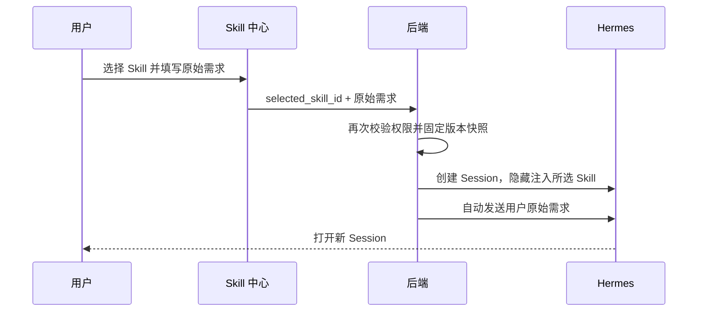

# HiTouch AI 中台 Skill 中心一期需求文档

## 1. 文档说明

- 文档状态：一期范围已确认，待产品、研发评审
- 适用范围：Skill 使用中心与轻量管理闭环
- 最后修订：2026-07-29
- 使用端：HiTouch 工作台、Skill 中心、Hermes Session
- 原型目录：`skill-center/prototype/`

一期同时交付使用中心和默认 Skill 管理，不再拆成两个发布阶段。

## 2. 方案判断与一期边界

使用中心在技术上可以单独上线，前提是已经存在另一个稳定的默认 Skill 分配入口。但当前方案没有可供 AI 产品经理使用的范围配置渠道。如果只交付使用中心：

- 部门和人员范围只能由研发手工配置。
- 使用中心可见集合与 Hermes `external_dirs` 难以形成可验收的产品闭环。
- 每次新增、调岗或收回权限都依赖技术人员。

因此，范围配置是使用中心上线的前置依赖，必须与使用中心同期交付。

这不等于建设重型管理后台。一期只保留完成闭环所需的轻量能力：

- 导入和更新默认 Skill。
- 默认全员、按需部门或人员分配。
- 停用和重新启用。
- 基础版本来源记录。

一期不增加审批、发布前暂存、操作日志、维护者或最近操作人。

## 3. 背景

HiTouch/Hermes 已经具备多种 Skill，但员工缺少显式入口，不清楚自己有哪些 Skill、每项 Skill 能解决什么问题，也难以主动选择指定 Skill 开始任务。

现有 Skill 主要来自：

1. 平台统一维护并分配给员工的默认 Skill。
2. Hermes 在用户个人目录中创建的个人 Skill。

部分默认 Skill 应供全员使用，部分只适用于特定部门或人员。平台需要同时解决：

- 员工如何发现并使用自己有权限的 Skill。
- 少量管理人员如何维护默认 Skill 及其范围。
- Hermes 如何只加载当前用户有效的 Skill。

## 4. 产品目标

1. 在 HiTouch 工作台和 Hermes 中提供明确的 Skill 中心入口。
2. 让用户查看、搜索和筛选自己当前可用的默认 Skill 与个人 Skill。
3. 让用户输入需求后，用指定 Skill 开启新的 Hermes Session。
4. 支持用户维护本人个人 Skill 的展示信息和删除本人个人 Skill。
5. 让具备 `skills` 权限的管理人员完成默认 Skill 导入、更新、范围配置和可用性控制。
6. 新导入默认对全员开放，有明确限制时才改为部门或人员范围。
7. 保证使用中心可见范围与新 Session 加载范围一致。
8. 不把内部名称、Skill 文件内容或隐藏注入指令暴露为聊天消息。

## 5. 名词与字段

### 5.1 默认 Skill

由平台统一维护并分配给员工的 Skill。

- 可以分配给全员，或分配给预置部门、指定人员组成的组合范围。
- 普通用户只能查看和使用。
- 未分配或已停用时，用户不可见且新 Session 不加载。

### 5.2 我创建的 Skill

由 Hermes 在当前用户个人 Skill 目录中创建的 Skill。

- 仅本人可见和使用。
- 本人可修改展示名称和“能帮你做什么”。
- 本人可删除目标个人 Skill。
- 实际能力内容仍通过 Hermes 对话维护。

### 5.3 Hermes 系统内置 Skill

Hermes 安装包自带、但未被 Skill 中心纳入默认 Skill 管理的系统能力。

- 不在 Skill 中心展示。
- 其底层运行行为不由本需求改变。

### 5.4 展示名称、作用与描述

| 字段 | 面向对象 | 用途 |
| --- | --- | --- |
| 展示名称 | 用户 | 卡片、详情、管理列表和搜索 |
| 作用 | 用户 | 回答“能帮你做什么”，用于展示和搜索 |
| Skill 描述 | AI | 来自 `SKILL.md`，参与搜索和加载，但不在使用视图展示 |
| Skill 内部名称 | 系统 | 用于底层识别，不作为用户消息 |
| `skill_id` | 系统 | 不可变主键，绑定范围、版本和 Session |

展示名称和作用是页面元数据，不进入 AI 上下文。

## 6. 一期范围

### 6.1 使用中心

- 工作台和 Hermes 窄栏入口。
- 卡片墙、来源筛选、搜索和详情。
- 输入需求并使用指定 Skill 创建新 Hermes Session。
- 个人 Skill 展示名称和作用编辑。
- 个人 Skill 删除及二次确认。
- 个人 Skill 作用自动生成、存量补齐和失败重试。

### 6.2 轻量管理

- Skill 中心内的“管理”页签。
- 默认 Skill 列表和搜索。
- 全部、启用中、已停用快捷筛选。
- 固定 Git 仓库导入或 ZIP 上传。
- 展示名称、作用和分配范围编辑。
- 默认 Skill 内容更新。
- 启用 / 停用控制。
- 基础版本记录。
- 参照当前企微通讯录预置的部门、人员选择；人员支持姓名搜索。

### 6.3 一期不包含

- 新增另一套 Skill 管理角色体系。
- 发布前暂存、审核或审批流。
- 操作日志、维护者、最近操作人或交接人。
- 在线新建完整 Skill。
- 网页代码编辑器或 Skill 文件树。
- 历史版本回滚、差异对比和下载。
- 任意 Git URL、任意仓库或浏览器端 Git 凭证。
- 在 Skill 中心新建或上传个人 Skill。
- 把个人 Skill 分享给其他同事。
- 管理员查看其他人的个人 Skill。
- 默认 Skill 删除、回收站和永久清理。
- 点赞、收藏、热度、排行和个性化推荐。

## 7. 用户与权限

### 7.1 普通内部用户

可以：

- 进入 Skill 中心。
- 查看和使用本人当前有效的默认 Skill 与个人 Skill。
- 编辑和删除本人的个人 Skill。

不能：

- 查看未分配或已停用的默认 Skill。
- 修改默认 Skill 或其分配范围。
- 查看其他人的个人 Skill。
- 查看或编辑 Skill 文件内容。

### 7.2 管理人员

现有 `admin` 和拥有 `skills` 权限的 `manager` 可以：

- 查看全部默认 Skill。
- 导入和更新默认 Skill。
- 编辑展示信息和分配范围。
- 停用和重新启用。
- 查看版本记录。

真实产品中，“管理”入口只对上述账号显示；服务端必须再次校验权限。原型固定展示最高权限账号视角，不模拟账号切换。

## 8. 入口与信息架构

### 8.1 HiTouch 工作台

在“常用功能”区域展示 Skill 中心卡片：

- 名称：Skill 中心
- 说明：浏览已分配的 Skill，并从合适的能力开始新任务
- 当前用户可用 Skill 数量

### 8.2 Hermes 入口

- 左侧窄栏展示 Skill 中心图标。
- 悬浮显示“Skill 中心”。
- Skill 中心页面具有明确选中态。
- Skill 中心不展示 Hermes 的 300px 对话上下文栏和 Workspace。
- 进入新 Session 后恢复上下文栏和 Workspace。

### 8.3 Skill 中心结构

```text
Skill 中心
├── 使用中心
│   ├── Skill 列表
│   ├── Skill 详情
│   ├── 使用 Skill
│   └── 个人 Skill 编辑 / 删除
└── 管理
    └── 默认 Skill
```

- 使用中心与管理共用页面框架。
- 管理地址为 `skill-center.html?mode=manage`。
- 不建设独立 `admin.html`。

## 9. 使用中心

### 9.1 可见数据

用户列表由以下数据合并产生：

1. 当前用户个人 Skill 目录中的有效 Skill。
2. 当前可用且分配范围命中该用户的默认 Skill。

以下对象不进入列表：

- 未纳入默认 Skill 管理的系统内置 Skill。
- 已停用的默认 Skill。
- 未分配给当前用户的默认 Skill。
- 其他用户的个人 Skill。

### 9.2 卡片与详情

卡片至少展示：

- 展示名称
- 来源标签：默认 / 我创建的
- 能帮你做什么
- 最近更新时间
- 默认 Skill 当前版本
- 使用按钮

详情展示相同核心信息。个人 Skill 额外提供“编辑展示信息”和“删除”。

卡片和详情均不展示 Skill 描述、完整 `SKILL.md`、references、scripts、assets 或其他 Skill 文件内容。

### 9.3 筛选、搜索与排序

- 来源筛选：全部、默认、我创建的。
- 搜索匹配：展示名称、作用、系统保存的 Skill 描述。
- 结果卡片不直接展示完整描述。
- 默认按最近更新时间倒序排列。

### 9.4 空状态

- 无任何可用 Skill：说明个人 Skill 可由 Hermes 创建，默认 Skill 由管理员分配。
- 当前来源为空：提供“查看全部”。
- 搜索无结果：提供“清空搜索”。

## 10. 使用 Skill 开启新对话

### 10.1 输入需求

- 每个可见 Skill 都提供“使用”入口。
- 用户必须填写本次具体需求。
- 空内容或仅空格不能提交。
- 支持多行输入。
- 主按钮为“开始对话”。
- 提交期间进入加载状态，防止重复创建。
- 弹窗不展示内部名称、Git Commit 或文件内容。

### 10.2 创建 Session



请求示意：

```json
{
  "message": "请根据客户情况生成代理记账报价建议",
  "selected_skill_id": "skill_id",
  "selected_skill_version": "version_snapshot_id"
}
```

约束：

- 前端只提交不可变 `selected_skill_id`，不提交目录路径、内部名称或 Skill 内容。
- 后端在创建 Session 时再次鉴权并固定版本。
- Skill 内容以隐藏的系统或开发者级上下文注入。
- 用户消息只保留原始需求，不拼接斜杠、内部名称或控制文本。
- 会话历史接口不得返回隐藏上下文全文。

### 10.3 失败处理

- Skill 已不可用：关闭使用流程并刷新列表。
- 创建失败：保留输入，允许重试，不重复创建 Session。
- 自动发送失败：保留已创建 Session，并提示重新发送原始需求。

## 11. 个人 Skill

### 11.1 产生方式

- Skill 中心不提供新建或上传入口。
- 个人 Skill 由 Hermes 在对话中创建。
- 创建完成后自动出现在“我创建的”列表。

### 11.2 作用补齐

- 新建个人 Skill 时由 AI 生成面向用户的作用。
- 存量 Skill 缺少作用时异步补齐。
- 生成期间显示“正在生成”。
- 生成失败不影响使用，并提供重试。
- 用户手工编辑后，旧异步结果不得覆盖新内容。

### 11.3 编辑与删除

- 只允许编辑展示名称和作用。
- 编辑不修改 Skill 文件或 AI 上下文。
- 删除前必须二次确认。
- 只删除目标个人 Skill 的完整目录，不影响个人 Skills 总目录和其他 Skill。
- 删除只影响新 Session；历史 Session 保持原上下文。

## 12. 默认 Skill 管理列表

### 12.1 列表字段

- 展示名称
- Skill 内部名称
- 作用
- 当前版本
- 分配范围摘要
- 最近更新时间
- 操作

正常启用项不重复展示“启用”；只有已停用项在名称旁显示弱提示。

### 12.2 搜索与操作

列表提供“全部 / 启用中 / 已停用”三个快捷 Tab，默认选中“全部”。快捷 Tab 与关键词搜索叠加生效；搜索匹配展示名称、内部名称和作用。

主列表不提供状态列或复杂筛选器，避免重复展示和增加管理负担。

每行保留：

- 编辑
- 停用或重新启用

当前版本号可直接查看版本记录。“编辑”抽屉内提供“更新内容”和“查看版本”入口。

## 13. 导入默认 Skill

### 13.1 固定 Git 仓库

- 仅支持 `HiTouchAI/hitouch-skills`。
- 管理员选择 Commit 和具体 Skill 目录。
- 一个目录必须包含有效 `SKILL.md`。
- 系统保存仓库、Commit、目录和内容校验值。
- 不自动跟随分支；新 Commit 只作为人工更新候选。
- Git 凭证仅保存在服务端。

### 13.2 ZIP 上传

- ZIP 必须包含一个有效 `SKILL.md`。
- 可包含 references、scripts、assets 和其他附属文件。
- 后端必须防止路径穿越、非法符号链接和不安全解压。
- 上传成功后自动 commit 并 push 到固定仓库形成来源快照。

### 13.3 三步流程

```text
1. 选择来源并完成校验
2. 确认展示名称和作用
3. 确认分配范围并导入
```

规则：

- 校验成功后解析内部名称和 Skill 描述。
- 展示名称和作用必填。
- 分配范围默认选择“全员”。
- 仅有明确业务限制时改为部门、人员或组合范围。
- 最终只保留一个确认按钮。
- 按钮明确显示“确认上传并对全员开放”或“确认上传并开放给指定范围”。
- 不提供“保存为未发布”或另一道“确认发布”。

确认可用前必须满足：

- 来源校验通过。
- `SKILL.md` 可解析出内部名称和描述。
- 展示名称和作用完整。
- 至少存在一种有效分配范围。

满足条件并确认后，新 Skill 立即进入“启用”。

## 14. 启用状态、编辑与更新

### 14.1 启用状态

默认 Skill 只保留一位启用开关：

| 状态 | 使用中心可见 | 新 Session 加载 | 操作 |
| --- | --- | --- | --- |
| 启用 | 按范围可见 | 按范围加载 | 编辑、更新、停用 |
| 已停用 | 否 | 否 | 编辑、更新、重新启用 |

- 停用保留原分配范围、版本记录和 Skill 文件。
- 重新启用后按原范围恢复。
- 一期不提供默认 Skill 删除和回收站；需要清理资产时由后续生命周期能力处理。
- 旧缓存中的 `published` 迁移为 `active`；`pending`、`disabled`、`offline` 和 `deleted` 统一迁移为 `inactive`。

### 14.2 编辑

可编辑：

- 展示名称
- 作用
- 分配范围

不可直接编辑：

- Skill 内部名称
- Skill 描述
- `SKILL.md` 和其他文件

任何状态都不能把分配范围清空。

### 14.3 更新内容

- 可选择固定仓库的新 Commit/目录，或上传新 ZIP。
- 更新必须填写更新说明。
- 更新后生成新的系统版本。
- 更新已有 Skill 时保留原分配范围和启用状态。
- 原来启用的继续启用；原来已停用的继续保持停用。
- 新版本只影响之后创建的新 Session。
- 历史 Session 保持启动时版本。

## 15. 分配范围

### 15.1 支持范围

- 全员
- 一个或多个预置部门
- 一个或多个指定人员
- 部门与人员组合

“全员”和“指定范围”是互斥模式：

- 选择“全员”时，不再选择部门或人员，保存数据时部门和人员列表均为空。
- 选择“指定范围”时，至少选择一个部门或一名人员。
- 指定范围内，部门和人员可以同时选择，最终范围取并集，同一用户只产生一份权限。

### 15.2 全员

- 新导入的默认选项。
- 覆盖全部有效内部用户。
- 后续新增并完成 HiTouch 绑定的员工自动获得。

### 15.3 部门

- 本期只提供部门级选项，不展示组织树、子部门继承或同步状态。
- 部门清单参照当前企微通讯录预置为：总部业务部、深圳公司、印尼公司、产品部、运营组、财务部、市场部、人力资源部、行政部、IT 部、AI 产品部、AI 技术部、其他。
- 权限计算依赖 HiTouch 后端维护的用户与部门映射。
- 在未接入企微前，部门清单和用户归属变化需要人工维护，不承诺随企微组织变更自动更新。

### 15.4 指定人员

- 支持按姓名模糊搜索。
- 搜索结果展示人员姓名和所属部门，便于同名人员辨识。
- 指定人员可以和一个或多个部门同时选择。
- 可选人员来自 HiTouch 后端维护的静态人员清单。

### 15.5 静态目录维护

- 本期不接入企微通讯录 API，也不提供同步、增量更新或失败重试。
- 页面不得展示“同步正常”“最近同步时间”等可能暗示已实时打通企微的信息。
- 部门和人员清单由后台配置或版本发布维护；配置变化只影响后续权限计算。
- 若后续需要自动跟随企微组织变化，再单独评估通讯录同步能力。

## 16. 可见性与 Hermes 加载

每次创建新 Session 时，服务端重新计算：

```text
新 Session Skill 集合
= 当前用户有效的个人 Skill
+ 当前启用且分配范围命中用户的默认 Skill
```

当前 Fleet 将 `/mnt/workspace/shared/skills` 整个根目录配置为大多数用户的 `external_dirs`。因此，Skill 只要仍在该目录中，单独修改 HiTouch 管理状态并不能阻止 Hermes 加载。这是一期必须改造的现状，不是目标方案。

目标规则：

- `/mnt/workspace/shared/skills` 只承担默认 Skill 文件存储，不等于某个用户的有效加载集合。
- 服务端根据“启用状态 + 分配范围”计算每个用户的有效默认 Skill 集合。
- Hermes 必须加载该有效集合，不得继续无条件加载整个 shared Skills 根目录。
- 实现可采用每用户有效目录/清单，或在 Gateway 构建 Skills prompt 前过滤；具体方案由研发评审确定。
- 已停用或未命中分配范围的默认 Skill 不得进入用户的有效加载集合。
- 停用不删除 shared 中的 Skill 文件，只从全部用户的有效加载集合中排除。
- 重新启用后，按原分配范围重新进入对应用户的有效加载集合。
- 状态、范围或内容变化后，必须使受影响用户的 `.skills_prompt_snapshot.json` 失效，并刷新对应 Gateway；不能只等待页面元数据生效。
- 管理端只有在有效集合刷新任务成功提交后才提示操作成功；刷新失败必须明确提示并允许重试。
- 权限、状态和内容变化只影响之后创建的新 Session。
- 历史 Session 保留启动时的 Skill 内容；紧急安全事件另行执行 Gateway 重启和旧 Session 处置。

## 17. 同名与版本

### 17.1 同名

- 每项 Skill 使用不可变 `skill_id`。
- 同一用户可见范围内出现同名时，后进入者增加序号。
- 创建 Session 始终以 `selected_skill_id` 绑定目标。
- 分配、版本和启用状态关联不依赖名称。
- 已停用 Skill 的内部名称继续保持占用，避免重新启用时发生错误覆盖。

### 17.2 版本记录

首次导入或内容更新生成版本记录：

- 系统版本号
- 更新时间
- 来源类型：Git / ZIP
- ZIP 文件标识，或 Git 仓库、目录与 Commit
- 内容校验值
- 更新说明
- 是否当前版本

一期只支持查看，不支持回滚。版本记录不包含维护者、操作人或操作日志。

## 18. 页面与原型

| 页面/入口 | 一期功能 | 原型路径 |
| --- | --- | --- |
| HiTouch 工作台 | Skill 中心入口和可用数量 | `prototype/index.html` |
| 使用中心 | 卡片、筛选、搜索、详情和使用 | `prototype/skill-center.html` |
| Hermes Session | 接收使用流程并恢复 Hermes 布局 | `prototype/session.html` |
| 默认 Skill 管理 | 列表、搜索、导入和行操作 | `prototype/skill-center.html?mode=manage` |
| 兼容入口 | 跳转模块化原型 | `Skill中心一期Demo.html` |

## 19. 一期验收标准

1. 用户可从工作台和 Hermes 窄栏进入 Skill 中心。
2. 使用中心只展示当前用户可用的默认 Skill 和本人个人 Skill。
3. 用户可按全部、默认、我创建的筛选，并搜索展示名称、作用和描述。
4. 卡片和详情均不展示 Skill 描述、完整 `SKILL.md` 或附属文件。
5. 每个可见 Skill 都提供使用入口。
6. 空需求不能提交；创建失败保留输入且不重复创建 Session。
7. 新 Session 通过隐藏 `selected_skill_id` 和版本快照使用指定 Skill，聊天消息只显示原始需求。
8. Session 创建时再次校验权限；失权 Skill 不再进入列表或加载集合。
9. 用户只能编辑和删除本人个人 Skill，不能修改默认 Skill。
10. 删除个人 Skill 只删除目标目录，并要求二次确认。
11. 有权限用户可以进入“管理”；普通用户看不到且不能直接访问。
12. 管理模块直接展示默认 Skill，不提供管理子导航、默认 Skill 删除或回收站。
13. 管理列表提供“全部 / 启用中 / 已停用”快捷 Tab，并与搜索叠加生效；不提供状态列，只有已停用项显示弱提示。
14. 管理员可从固定 Git 仓库导入，不能输入任意仓库或凭证。
15. 管理员可上传合法 ZIP；非法包被阻止。
16. 新导入默认全员且确认后立即可用。
17. “全员”和“指定范围”互斥；指定范围内部门与人员可共存且取并集，范围不能清空。
18. 最终只存在一次明确确认，不存在发布前暂存或二次发布流程。
19. 编辑默认 Skill 可维护展示名称、作用和范围。
20. 内容更新保留原范围和启用状态，并生成版本记录。
21. 停用后使用中心立即不可见，新 Session 不加载；重新启用后按原范围恢复。
22. 部门按预置部门级清单选择；指定人员可按姓名搜索并显示所属部门。
23. Hermes 只加载当前用户有效 Skill，不直接加载整个 shared 根目录。
24. 停用或范围变化会使受影响用户的 Skills 快照失效并触发 Gateway 刷新。
25. 管理变更只影响之后创建的新 Session。
26. 版本记录包含来源、校验值和 Git Commit，不包含维护者和操作人。
27. 管理模块不提供操作日志。
28. Skill 中心无 300px 对话上下文栏和 Workspace；进入 Session 后恢复。
29. 1280px、1440px、1920px 视口无横向溢出，表格和抽屉操作稳定。

## 20. 研发评审待确定

1. 使用中心读取个人 Skill 元数据和有效默认 Skill 集合的接口。
2. 默认 Skill 元数据、版本、状态和分配规则的数据表。
3. `selected_skill_id`、版本快照、隐藏上下文注入和 Session 创建幂等方案。
4. 会话历史接口对隐藏上下文的隔离方案。
5. 固定 Git 仓库读取凭证和 ZIP 自动提交方式。
6. ZIP 解压隔离、文件大小、类型和路径安全限制。
7. 静态部门及人员清单的数据来源、人工维护方式，以及 HiTouch 用户与部门映射。
8. 权限变化后使用中心缓存和 Session 配置的刷新机制。
9. 每用户有效 Skill 目录/清单的生成方式，以及 Gateway 加载前过滤方案。
10. `.skills_prompt_snapshot.json` 失效、受影响 Gateway 刷新和失败重试机制。
11. 同名展示名称与有效内部名称的映射方案。
12. 个人 Skill 作用生成、补齐和失败重试机制。
